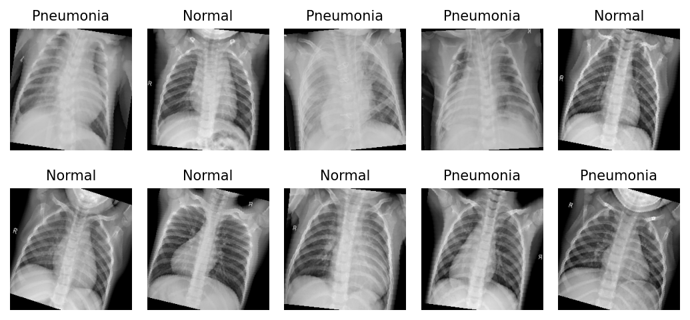
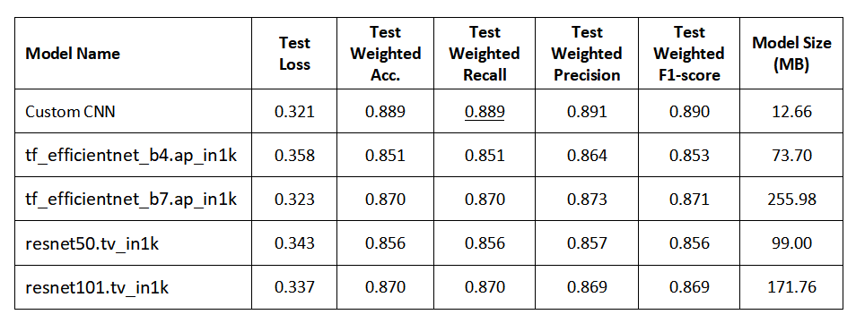
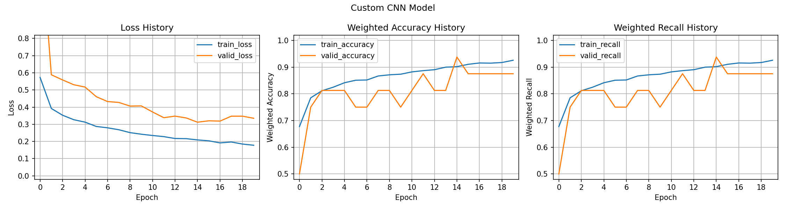
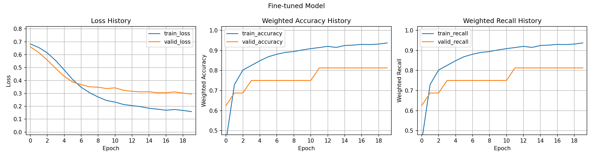
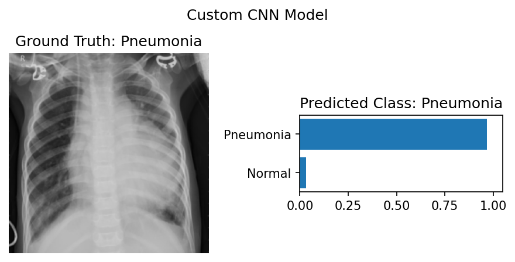
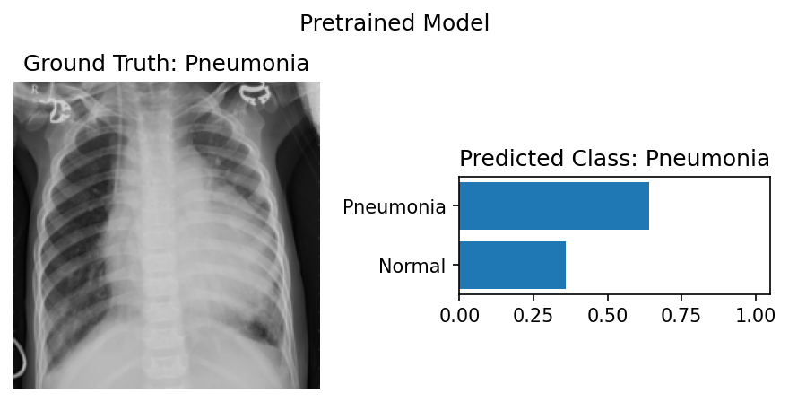

# Pneumonia Detection in Chest X-Ray Images



## Project Overview

This project uses custom and pretrained Convolutional Neural Network (CNN) models to classify chest X-ray images into two categories: normal and pneumonia. The goal is to build an accurate model to assist in the early diagnosis of pneumonia, leveraging image processing techniques and neural networks.

## Project Motivation

Pneumonia is a serious respiratory infection that can be life-threatening if not diagnosed early. Given the accessibility of chest X-rays, this project explores using deep learning to aid in rapid, accurate detection of pneumonia, potentially reducing the diagnostic burden on radiologists.

## Dataset

The dataset for this project consists of labeled chest X-ray images, categorized into **Normal** and **Pneumonia** cases. This publicly available dataset, hosted on [Kaggle](https://www.kaggle.com/datasets/paultimothymooney/chest-xray-pneumonia/data) [1], is organized into three main folders: **train**, **test**, and **val**, each containing subfolders for the two categories. The dataset includes a total of 5863 grayscale X-ray images in JPEG format.

Normal chest X-rays depict clear lungs with no areas of abnormal opacification, while pneumonia cases typically exhibit a diffuse "interstitial" pattern across both lungs, indicating areas affected by the infection.

## Project Workflow

## Data Preprocessing

The images are provided in grayscale, containing a single channel, with varying heights and widths. They are imported into the program using PyTorch’s `datasets.ImageFolder` class. The image transformation pipeline includes resizing each image to a standard 224x224 resolution.

To enhance model robustness, data augmentation is applied: since the images are symmetric, each image has a 50% probability of being flipped horizontally. Additionally, images are randomly rotated between -20 and 20 degrees. Afterward, they are scaled and converted to PyTorch tensors.

Normalization is performed by calculating the mean and standard deviation values specifically for each channel. Finally, the single-channel images are expanded to three channels by duplicating the grayscale values across all channels.

For the validation and test transformation pipelines, random horizontal flipping and rotation are omitted, as these augmentations are not necessary. The transformation pipeline for the pretrained model is similar but uses separate normalization values, based on those from the ImageNet dataset.

To boost performance, all images from the training, validation, and test sets are preloaded into memory. A `CustomDataset` class is used to access each image and apply the appropriate transformations as needed.

The training dataset is imbalanced, with 3875 samples in the Pneumonia class and 1341 samples in the Normal class, resulting in a 3:1 ratio. To address this imbalance, we apply class weights in the cross-entropy loss function. This approach assigns a higher penalty for misclassifying the underrepresented class, helping to improve model performance across both classes. Class weights are calculated using the `compute_class_weight` function from Scikit-learn.

## Model Architecture

**Custom CNN Model**: This custom model, built and trained from scratch, consists of five blocks of convolutional and max pooling layers tailored for feature extraction in medical imaging. Each convolutional layer has a kernel size of 3, with output filters set to 8, 16, 32, 64, and 128, respectively. Following each convolutional layer is a max pooling layer with a kernel size of 2 and a stride of 2, which downsamples the images by half.

Each block also includes a batch normalization layer, placed after the ReLU activation layer to enhance training stability and improve model performance. At the top of the network are two fully connected (dense) layers, with the final layer outputting two features corresponding to the two classes. This architecture comprises approximately 2.3 million parameters and has a model size of around 13 MB.


**Pretrained CNN Models**: Transfer learning is applied using popular architectures, specifically EfficientNet and ResNet models, to leverage pre-learned features and fine-tune them for pneumonia detection. We utilize four pretrained models with varying architectures and depths: `tf_efficientnet_b4`, `tf_efficientnet_b7`, `resnet50`, and `resnet101`, all initially trained on the ImageNet dataset. The `tf_efficientnet_b7` and `resnet101` models are deeper, more complex versions of `tf_efficientnet_b4` and `resnet50`, providing greater capacity for learning image features. These models were selected for their proven effectiveness in other medical imaging applications.

## Training and Evaluation

Model training is monitored using metrics such as weighted accuracy, weighted precision, weighted recall, and weighted F1-score, with recall being especially relevant in this case, as the goal is to maximize true positives and minimize false negatives. Metrics are implemented using the `torchmetrics` library.

To account for class imbalance, the "average" parameter in the metric functions is set to "weighted." This setting calculates metrics (e.g., recall) for each class individually, weighting each class’s score by its sample count (support). The final metric is then a weighted sum, providing a fair evaluation that considers the distribution of samples in each class.

The training process uses cross-entropy loss with class weights and the Adam optimizer, with a learning rate of 0.000005 for the custom CNN model and 0.0001 for the pretrained models. Models are trained for 20 epochs, with an early stopping mechanism set to a patience of 5 epochs. A batch size of 128 was chosen as it effectively balances computational efficiency with a stable loss curve.

## Results and Observations

During training, the model with the lowest loss is saved and later used to evaluate performance on the test set. Among all the models, the one with the highest weighted recall is selected as the best-performing model. A summary of the results is presented in the table below.



**Best Model**: The custom CNN model achieved a weighted recall of 0.889 on the test set, with an F1-score of 0.89, placing it first in classification performance on our dataset. At 12.66 MB, it is the smallest model among all tested models, making it particularly suitable for applications with memory constraints. The graphs below illustrate the training metrics history for the custom CNN model.



Among the pretrained models, EfficientNet-B7 performed closely, achieving a weighted recall of 0.870, though it has a significantly larger memory footprint.

The graphs below show the metrics history during the fine-tuning process of the pretrained EfficientNet-B7 model.



The images below display a sample that was classified as pneumonia by both the custom model and the fine-tuned EfficientNet-B7 model.





## Key Challenges

+ **Model Fluctuations**: Significant fluctuations were initially observed during the training of the custom CNN model. These fluctuations were mitigated by adjusting the learning rate and batch size. Specifically, a very small learning rate of 0.000005 was required to stabilize training of the custom CNN model.

+ **Model Overfitting**: To reduce overfitting, dropout layers were added between the linear layers, and the model's complexity was carefully adjusted to an optimal level. Early stopping was also implemented to halt training if validation loss increased over a set number of epochs. Additionally, data augmentation was applied to expand the dataset artificially by creating modified versions of the training samples, enhancing the model's generalization ability.

+ **Single vs. Multi-Channel Input**: The data is provided as grayscale single-channel images. During experiments, we observed that the model performed better when trained on three-channel images (with the single channel repeated across all three channels) compared to single-channel inputs. Therefore, we opted to use three-channel images for model training. This behavior may be attributed to the following factors:

1. **Learning Dynamics in the Initial Layers**: When the model processes a 3-channel input, the convolutional layers are applied across three identical channels, which may help it learn more robust patterns by combining information across channels. Each filter in the convolution layer can capture and reinforce slightly different aspects of the same grayscale information, potentially leading to better feature learning.

2. **Batch Normalization and Variance in Activation**: When we use 3 channels, even if the channels are identical, the batch normalization layers might operate with more stable statistics because there are more "features" to normalize across channels. This can stabilize training and contribute to a smoother gradient flow, potentially yielding better optimization.

## Future Improvements

With additional resources, further hyperparameter tuning could enhance model performance. Testing additional pretrained models would allow for performance comparisons on this dataset, and transfer learning with models pretrained specifically on medical imaging datasets, particularly X-ray images, could provide further benefits. For the custom CNN model, experimenting with deeper and more advanced architectures may improve accuracy. Additionally, training with higher-resolution images could yield better results. However, higher-resolution images also come with trade-offs in terms of increased computational requirements, longer training times, and greater memory usage.

## References

[1] Chest X-Ray Images (Pneumonia) https://www.kaggle.com/datasets/paultimothymooney/chest-xray-pneumonia/data

[2] Identifying Medical Diagnoses and Treatable Diseases by Image-Based Deep Learning
https://www.cell.com/cell/fulltext/S0092-8674(18)30154-5?_returnURL=https%3A%2F%2Flinkinghub.elsevier.com%2Fretrieve%2Fpii%2FS0092867418301545%3Fshowall%3Dtrue

[3] Large Dataset of Labeled Optical Coherence Tomography (OCT) and Chest X-Ray Images
https://data.mendeley.com/datasets/rscbjbr9sj/3

## Repository Structure

```
├── Images: All the images including the one for README
├── Notebook: Main notebook
├── PDF: PDF file of the notebook
├── README.md : Project information and repository structure
```
